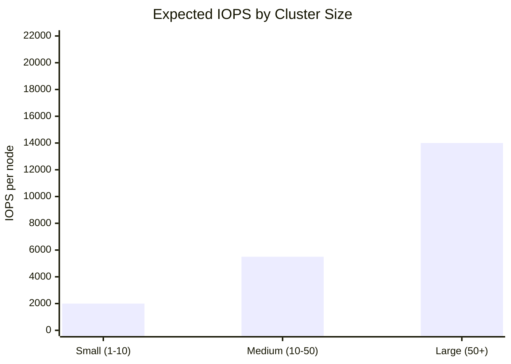

# Why IOPS, Cluster Sizes, and Filesystems Matter in Kubernetes

When designing Kubernetes clusters for production workloads, three critical factors often determine the success or failure of your deployment: **IOPS (Input/Output Operations Per Second)**, **cluster sizing**, and **filesystem selection**. These foundational elements directly impact application performance, scalability, and reliability.

## Understanding IOPS in Kubernetes Context

### What Are IOPS?

IOPS measure how many read and write operations your storage system can handle per second. In Kubernetes environments, this translates to how quickly your pods can:

- Start up and load container images
- Read configuration files and secrets
- Write logs and application data
- Handle database operations
- Process file-based workloads

### IOPS Requirements by Workload Type

Different workloads have vastly different IOPS requirements:

```yaml
# Example: Database workload requiring high IOPS
apiVersion: v1
kind: PersistentVolumeClaim
metadata:
  name: database-storage
spec:
  accessModes:
    - ReadWriteOnce
  resources:
    requests:
      storage: 100Gi
  storageClassName: fast-ssd
  # Annotations for cloud providers
  annotations:
    volume.beta.kubernetes.io/storage-provisioned-iops: "3000"
```

| Workload Type | Minimum IOPS | Typical IOPS | Storage Tier |
|---|---|---|---|
| Databases | 1,000 | 3,000–10,000+ | NVMe SSD |
| Log aggregation | 500 | 500–2,000 | SSD |
| Web applications | 100 | 100–500 | SSD or HDD |
| Batch processing | 50 | 50–200 | HDD |
| Static content | 10 | 10–50 | HDD |

## Cluster Sizing: The Foundation of Performance

### Node Sizing Strategies

Cluster sizing isn't just about CPU and memory—storage performance scales with your infrastructure choices:

| Cluster Size | Nodes | CPU (per node) | RAM (per node) | Storage (per node) | Network | Expected IOPS |
|---|---|---|---|---|---|---|
| Small | 1–10 | 4–8 cores | 16–32 GB | 100–500 GB SSD | 1–10 Gbps | 1,000–3,000 |
| Medium | 10–50 | 8–16 cores | 32–64 GB | 500–1,000 GB SSD | 10–25 Gbps | 3,000–8,000 |
| Large | 50+ | 16–32+ cores | 64–128+ GB | 1,000+ GB NVMe SSD | 25+ Gbps | 8,000–20,000+ |



### Storage Distribution Patterns

```bash
# Example: Distributing storage across availability zones
kubectl get nodes -o custom-columns=NAME:.metadata.name,ZONE:.metadata.labels.'topology\.kubernetes\.io/zone',STORAGE:.status.allocatable.ephemeral-storage
```

## Filesystem Selection: The Hidden Performance Factor

### Filesystem Comparison for Kubernetes

| Filesystem | Use Case | IOPS Performance | Pros | Cons |
|------------|----------|------------------|------|------|
| **ext4** | General purpose | Good | Stable, widely supported | Limited scalability |
| **XFS** | Large files, databases | Excellent | High performance, scalable | Complex tuning |
| **Btrfs** | Advanced features | Good | Snapshots, compression | Less mature |
| **ZFS** | Enterprise storage | Excellent | Data integrity, features | Resource intensive |

### Filesystem Tuning for Kubernetes

#### XFS Optimization Example
```bash
# Mount options for high-performance XFS in Kubernetes nodes
/dev/sdb1 /var/lib/kubelet xfs defaults,noatime,largeio,inode64,allocsize=16m 0 2
```

#### ext4 Tuning
```bash
# High-performance ext4 configuration
/dev/sdb1 /var/lib/kubelet ext4 defaults,noatime,data=writeback,barrier=0,nobh 0 2
```

## Real-World Performance Impact

### Case Study: E-commerce Platform

| Metric | Before | After | Improvement |
|---|---|---|---|
| Storage | Spinning disks | SSD + XFS | — |
| IOPS per node | 150 avg | 5,000 avg | 33x |
| Pod startup time | 45–60s | 5–10s | ~6–9x faster |
| DB query latency | 500–1,000ms | 50–100ms | ~10x faster |

### Monitoring IOPS in Kubernetes

```yaml
# Prometheus monitoring for storage performance
apiVersion: monitoring.coreos.com/v1
kind: ServiceMonitor
metadata:
  name: node-exporter-storage
spec:
  selector:
    matchLabels:
      app: node-exporter
  endpoints:
  - port: metrics
    path: /metrics
    interval: 30s
```

Key metrics to monitor:

```promql
# IOPS utilization
rate(node_disk_reads_completed_total[5m]) + rate(node_disk_writes_completed_total[5m])

# Disk latency
rate(node_disk_read_time_seconds_total[5m]) / rate(node_disk_reads_completed_total[5m])

# Queue depth
node_disk_io_now
```

## Best Practices for Production

### 1. Storage Class Design
```yaml
apiVersion: storage.k8s.io/v1
kind: StorageClass
metadata:
  name: high-iops-ssd
provisioner: kubernetes.io/aws-ebs
parameters:
  type: io2
  iops: "3000"
  fsType: xfs
  reclaimPolicy: Retain
allowVolumeExpansion: true
volumeBindingMode: WaitForFirstConsumer
```

### 2. Resource Limits and Requests
```yaml
apiVersion: v1
kind: Pod
spec:
  containers:
  - name: database
    resources:
      requests:
        memory: "2Gi"
        cpu: "500m"
        ephemeral-storage: "10Gi"
      limits:
        memory: "4Gi"
        cpu: "1000m"
        ephemeral-storage: "20Gi"
```

### 3. Node Affinity for Storage
```yaml
apiVersion: apps/v1
kind: Deployment
spec:
  template:
    spec:
      affinity:
        nodeAffinity:
          requiredDuringSchedulingIgnoredDuringExecution:
            nodeSelectorTerms:
            - matchExpressions:
              - key: node.kubernetes.io/instance-type
                operator: In
                values: ["i3.xlarge", "i3.2xlarge"]  # NVMe instances
```

## Conclusion

The intersection of IOPS, cluster sizing, and filesystem selection creates a performance triangle that determines your Kubernetes cluster's capabilities. Ignoring any one of these factors can create bottlenecks that no amount of CPU or memory can overcome.

**Key Takeaways:**

1. **Match IOPS to workload requirements** - Don't over-provision, but ensure sufficient headroom
2. **Size clusters based on storage patterns** - Consider both compute and storage scaling together  
3. **Choose filesystems deliberately** - XFS for high-performance, ext4 for stability
4. **Monitor continuously** - Storage performance degrades over time without proper monitoring
5. **Test under load** - Storage performance characteristics change dramatically under pressure

By treating storage as a first-class citizen in your Kubernetes architecture decisions, you'll build more resilient, performant, and cost-effective clusters.

---

*Want to discuss storage optimization strategies for your Kubernetes infrastructure? Connect with me on [LinkedIn]({{ site.author.linkedin }}) or check out more articles on cloud-native architecture.*