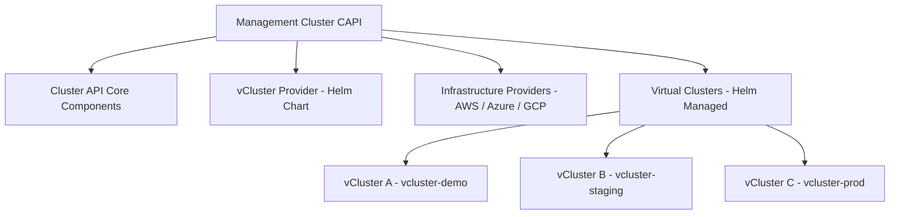

# Building vCluster Demos with Helm Charts and Cluster API: Enterprise-Grade Virtual Clusters

Virtual clusters (vClusters) deployed through Helm charts and Cluster API represent the enterprise approach to Kubernetes multi-tenancy. This method provides GitOps compatibility, declarative management, and integration with existing CAPI infrastructure. In this guide, I'll show you how to build a professional vCluster demo using Helm charts and the Cluster API vCluster provider.

## What is vCluster with Cluster API?

The vCluster Cluster API provider enables declarative management of virtual Kubernetes clusters through standard CAPI resources. This enterprise approach provides:

- **GitOps Integration** - Manage vClusters through standard Kubernetes manifests
- **Lifecycle Management** - Automated provisioning, scaling, and deprovisioning  
- **Enterprise Features** - RBAC, resource quotas, and policy enforcement
- **Multi-Cloud Support** - Deploy across different infrastructure providers
- **Observability** - Native integration with monitoring and logging solutions

## Why Use Helm Charts for vCluster?

- **Reproducible Deployments** - Version-controlled configurations
- **Templating Power** - Dynamic configuration based on environments
- **Dependency Management** - Handle complex deployment requirements
- **Enterprise Standards** - Follows Kubernetes deployment best practices
- **GitOps Ready** - Perfect for automated deployment pipelines

## Architecture Overview



## Prerequisites

Ensure your environment includes:

```bash
# Required tools
kubectl >= 1.25
helm >= 3.8
clusterctl >= 1.5

# A management cluster with:
# - Cluster API v1.5+ installed
# - vCluster provider installed via Helm
# - Sufficient resources for virtual clusters
```

## Step 1: Setting Up Cluster API with vCluster Provider

First, let's set up Cluster API and install the vCluster provider using Helm charts:

### Initialize Cluster API

```bash
# Initialize Cluster API (if not already done)
clusterctl init

# Verify CAPI installation
kubectl get providers -A
kubectl get pods -n capi-system
```

### Install vCluster Provider via Helm

```bash
# Add the vCluster Helm repository
helm repo add loft-sh https://charts.loft.sh
helm repo update

# Create namespace for vCluster provider
kubectl create namespace capi-vcluster-system

# Install the vCluster provider via Helm with enterprise configuration
helm install vcluster-provider loft-sh/cluster-api-provider-vcluster \
  --namespace capi-vcluster-system \
  --set provider.version=v0.2.2 \
  --set provider.resources.requests.memory=256Mi \
  --set provider.resources.requests.cpu=100m \
  --set provider.resources.limits.memory=512Mi \
  --set provider.resources.limits.cpu=500m \
  --set provider.replicas=1 \
  --wait

# Verify provider installation
kubectl get providers -A
kubectl get pods -n capi-vcluster-system
```

### Verify Installation

```bash
# Check that the vCluster provider is ready
kubectl get providers cluster-api-provider-vcluster -o yaml

# Verify Custom Resource Definitions are installed
kubectl get crd | grep vcluster
kubectl api-resources | grep vcluster
```

## Step 2: Creating Professional Helm Charts for vCluster

Let's create a professional Helm chart structure for our vCluster deployments:

### Create Helm Chart Structure

```bash
# Create Helm chart for vCluster deployments
mkdir -p vcluster-enterprise/
cd vcluster-enterprise/

helm create .
rm -rf templates/*  # We'll create our own templates

# Create proper directory structure
mkdir -p templates/environments
mkdir -p templates/monitoring
mkdir -p templates/security
```

### Chart.yaml Configuration

```yaml
# Chart.yaml
apiVersion: v2
name: vcluster-enterprise
description: Enterprise-grade Helm chart for deploying vCluster with Cluster API
type: application
version: 0.1.0
appVersion: "v0.19.5"

dependencies:
  - name: vcluster
    version: "0.19.5"
    repository: "https://charts.loft.sh"
    condition: vcluster.enabled

keywords:
  - vcluster
  - cluster-api
  - kubernetes
  - multi-tenancy
  - enterprise

maintainers:
  - name: "DevOps Team"
    email: "devops@yourcompany.com"

annotations:
  category: Infrastructure
  license: Apache-2.0
```

### Values.yaml Template

```yaml
# values.yaml
global:
  domain: "company.com"
  environment: "demo"
  clusterName: "management-cluster"

# vCluster configuration
vcluster:
  enabled: true
  
  # Basic configuration
  config:
    kubernetesVersion: "v1.29.0"
    image: "rancher/k3s:v1.29.0-k3s1"
  
  # Resource configuration
  resources:
    syncer:
      requests:
        memory: "256Mi"
        cpu: "100m"
      limits:
        memory: "1Gi"
        cpu: "500m"
    
    vcluster:
      requests:
        memory: "512Mi"
        cpu: "200m"
      limits:
        memory: "2Gi"
        cpu: "1000m"
  
  # Storage configuration
  storage:
    persistence: true
    size: "5Gi"
    storageClass: "fast-ssd"
  
  # Networking
  service:
    type: "ClusterIP"
  
  # Security
  rbac:
    create: true
  
  serviceAccount:
    create: true
    name: ""

# Cluster API configuration
clusterAPI:
  enabled: true
  provider: "vcluster"
  
  cluster:
    name: ""  # Will be templated
    namespace: ""  # Will be templated
  
  # Resource quotas for the virtual cluster
  resourceQuota:
    enabled: true
    hard:
      requests.cpu: "2"
      requests.memory: "4Gi"
      limits.cpu: "4"
      limits.memory: "8Gi"
      persistentvolumeclaims: "5"
      services: "10"
      pods: "20"

# Monitoring configuration
monitoring:
  enabled: false
  serviceMonitor:
    enabled: false
  grafana:
    enabled: false

# Network policies
networkPolicies:
  enabled: true

# Ingress configuration
ingress:
  enabled: false
  className: "nginx"
  annotations: {}
  hosts: []
  tls: []
```

## Step 3: CAPI vCluster Resource Templates

Create the core Cluster API resource templates for vCluster management:

### Main vCluster Template

```yaml
# templates/vcluster.yaml

{{- if .Values.clusterAPI.enabled }}
apiVersion: infrastructure.cluster.x-k8s.io/v1alpha1
kind: VCluster
metadata:
  name: {{ include "vcluster-enterprise.fullname" . }}
  namespace: {{ .Values.clusterAPI.cluster.namespace | default .Release.Namespace }}
  labels:
    {{- include "vcluster-enterprise.labels" . | nindent 4 }}
    app.kubernetes.io/component: vcluster
    cluster.x-k8s.io/cluster-name: {{ .Values.clusterAPI.cluster.name | default (include "vcluster-enterprise.fullname" .) }}
spec:
  # Kubernetes version for the virtual cluster
  kubernetesVersion: {{ .Values.vcluster.config.kubernetesVersion | default "v1.29.0" }}
  
  # Helm release configuration for vCluster
  helmRelease:
    chart:
      name: "vcluster"
      repo: "https://charts.loft.sh"
      version: "0.19.5"
    
    values: |
      # Syncer configuration
      syncer:
        {{- if .Values.vcluster.resources.syncer }}
        resources:
          {{- toYaml .Values.vcluster.resources.syncer | nindent 10 }}
        {{- end }}
        extraArgs:
          - --out-kube-config-server=https://{{ include "vcluster-enterprise.fullname" . }}.{{ .Values.global.domain }}
      
      # vCluster server configuration
      vcluster:
        image: {{ .Values.vcluster.config.image | default "rancher/k3s:v1.29.0-k3s1" }}
        {{- if .Values.vcluster.resources.vcluster }}
        resources:
          {{- toYaml .Values.vcluster.resources.vcluster | nindent 10 }}
        {{- end }}
        extraArgs:
          - --disable=traefik
          - --disable=servicelb
          - --disable=metrics-server
      
      # Storage configuration
      {{- if .Values.vcluster.storage }}
      storage:
        {{- toYaml .Values.vcluster.storage | nindent 8 }}
      {{- end }}
      
      # Service configuration
      {{- if .Values.vcluster.service }}
      service:
        {{- toYaml .Values.vcluster.service | nindent 8 }}
      {{- end }}
      
      # RBAC configuration
      {{- if .Values.vcluster.rbac.create }}
      rbac:
        clusterRole:
          create: true
        role:
          create: true
      {{- end }}
      
      # Service Account configuration
      {{- if .Values.vcluster.serviceAccount.create }}
      serviceAccount:
        create: true
        name: {{ .Values.vcluster.serviceAccount.name | default (include "vcluster-enterprise.serviceAccountName" .) }}
      {{- end }}

  # Resource management
  {{- if .Values.clusterAPI.resourceQuota.enabled }}
  resourceQuota:
    {{- toYaml .Values.clusterAPI.resourceQuota.hard | nindent 4 }}
  {{- end }}

  # Networking
  networking:
    serviceDomain: "cluster.local"
    podSubnet: "10.244.0.0/16"
    serviceSubnet: "10.96.0.0/12"

{{- end }}

```

### Helper Templates

```yaml
# templates/_helpers.tpl

{{/*
Expand the name of the chart.
*/}}
{{- define "vcluster-enterprise.name" -}}
{{- default .Chart.Name .Values.nameOverride | trunc 63 | trimSuffix "-" }}
{{- end }}

{{/*
Create a default fully qualified app name.
*/}}
{{- define "vcluster-enterprise.fullname" -}}
{{- if .Values.fullnameOverride }}
{{- .Values.fullnameOverride | trunc 63 | trimSuffix "-" }}
{{- else }}
{{- $name := default .Chart.Name .Values.nameOverride }}
{{- if contains $name .Release.Name }}
{{- .Release.Name | trunc 63 | trimSuffix "-" }}
{{- else }}
{{- printf "%s-%s" .Release.Name $name | trunc 63 | trimSuffix "-" }}
{{- end }}
{{- end }}
{{- end }}

{{/*
Create chart name and version as used by the chart label.
*/}}
{{- define "vcluster-enterprise.chart" -}}
{{- printf "%s-%s" .Chart.Name .Chart.Version | replace "+" "_" | trunc 63 | trimSuffix "-" }}
{{- end }}

{{/*
Common labels
*/}}
{{- define "vcluster-enterprise.labels" -}}
helm.sh/chart: {{ include "vcluster-enterprise.chart" . }}
{{ include "vcluster-enterprise.selectorLabels" . }}
{{- if .Chart.AppVersion }}
app.kubernetes.io/version: {{ .Chart.AppVersion | quote }}
{{- end }}
app.kubernetes.io/managed-by: {{ .Release.Service }}
app.kubernetes.io/part-of: vcluster-enterprise
{{- end }}

{{/*
Selector labels
*/}}
{{- define "vcluster-enterprise.selectorLabels" -}}
app.kubernetes.io/name: {{ include "vcluster-enterprise.name" . }}
app.kubernetes.io/instance: {{ .Release.Name }}
{{- end }}

{{/*
Create the name of the service account to use
*/}}
{{- define "vcluster-enterprise.serviceAccountName" -}}
{{- if .Values.vcluster.serviceAccount.create }}
{{- default (include "vcluster-enterprise.fullname" .) .Values.vcluster.serviceAccount.name }}
{{- else }}
{{- default "default" .Values.vcluster.serviceAccount.name }}
{{- end }}
{{- end }}

```

### Resource Quota Template

```yaml
# templates/security/resource-quota.yaml

{{- if .Values.clusterAPI.resourceQuota.enabled }}
apiVersion: v1
kind: ResourceQuota
metadata:
  name: {{ include "vcluster-enterprise.fullname" . }}-quota
  namespace: {{ .Release.Namespace }}
  labels:
    {{- include "vcluster-enterprise.labels" . | nindent 4 }}
spec:
  hard:
    {{- toYaml .Values.clusterAPI.resourceQuota.hard | nindent 4 }}
---
apiVersion: v1
kind: LimitRange
metadata:
  name: {{ include "vcluster-enterprise.fullname" . }}-limits
  namespace: {{ .Release.Namespace }}
  labels:
    {{- include "vcluster-enterprise.labels" . | nindent 4 }}
spec:
  limits:
  - default:
      memory: "512Mi"
      cpu: "500m"
    defaultRequest:
      memory: "128Mi"
      cpu: "100m"
    type: Container
  - max:
      memory: "2Gi"
      cpu: "1"
    min:
      memory: "64Mi"
      cpu: "50m"
    type: Container
{{- end }}

```

## Step 4: Environment-Specific Values and Helm Deployments

Create environment-specific values files for different deployment scenarios:

### Development Environment Values

```yaml
# values-dev.yaml
global:
  domain: "dev.company.com"
  environment: "development"

vcluster:
  enabled: true
  
  config:
    kubernetesVersion: "v1.29.0"
  
  resources:
    syncer:
      requests:
        memory: "128Mi"
        cpu: "50m"
      limits:
        memory: "512Mi"
        cpu: "200m"
    
    vcluster:
      requests:
        memory: "256Mi"
        cpu: "100m"
      limits:
        memory: "1Gi"
        cpu: "500m"
  
  storage:
    persistence: false  # Ephemeral for development
  
  service:
    type: "ClusterIP"

clusterAPI:
  enabled: true
  cluster:
    name: "vcluster-dev"
    namespace: "vcluster-dev"
  
  resourceQuota:
    enabled: true
    hard:
      requests.cpu: "1"
      requests.memory: "2Gi"
      limits.cpu: "2"
      limits.memory: "4Gi"
      persistentvolumeclaims: "2"
      services: "5"
      pods: "10"

monitoring:
  enabled: false

networkPolicies:
  enabled: false  # Simplified for development

ingress:
  enabled: false
```

### Staging Environment Values

```yaml
# values-staging.yaml
global:
  domain: "staging.company.com"
  environment: "staging"

vcluster:
  enabled: true
  
  config:
    kubernetesVersion: "v1.29.0"
  
  resources:
    syncer:
      requests:
        memory: "256Mi"
        cpu: "100m"
      limits:
        memory: "1Gi"
        cpu: "500m"
    
    vcluster:
      requests:
        memory: "512Mi"
        cpu: "200m"
      limits:
        memory: "2Gi"
        cpu: "1000m"
  
  storage:
    persistence: true
    size: "5Gi"
    storageClass: "standard"
  
  service:
    type: "ClusterIP"

clusterAPI:
  enabled: true
  cluster:
    name: "vcluster-staging"
    namespace: "vcluster-staging"
  
  resourceQuota:
    enabled: true
    hard:
      requests.cpu: "2"
      requests.memory: "4Gi"
      limits.cpu: "4"
      limits.memory: "8Gi"
      persistentvolumeclaims: "5"
      services: "10"
      pods: "20"

monitoring:
  enabled: true
  serviceMonitor:
    enabled: true

networkPolicies:
  enabled: true

ingress:
  enabled: true
  className: "nginx"
  annotations:
    cert-manager.io/cluster-issuer: "letsencrypt-staging"
  hosts:
    - host: "vcluster-staging.company.com"
      paths:
        - path: "/"
          pathType: "Prefix"
  tls:
    - secretName: "vcluster-staging-tls"
      hosts:
        - "vcluster-staging.company.com"
```

### Production Environment Values

```yaml
# values-prod.yaml
global:
  domain: "company.com"
  environment: "production"

vcluster:
  enabled: true
  
  config:
    kubernetesVersion: "v1.29.0"
  
  resources:
    syncer:
      requests:
        memory: "512Mi"
        cpu: "200m"
      limits:
        memory: "2Gi"
        cpu: "1000m"
    
    vcluster:
      requests:
        memory: "1Gi"
        cpu: "500m"
      limits:
        memory: "4Gi"
        cpu: "2000m"
  
  storage:
    persistence: true
    size: "20Gi"
    storageClass: "fast-ssd"
  
  service:
    type: "ClusterIP"

clusterAPI:
  enabled: true
  cluster:
    name: "vcluster-prod"
    namespace: "vcluster-prod"
  
  resourceQuota:
    enabled: true
    hard:
      requests.cpu: "4"
      requests.memory: "8Gi"
      limits.cpu: "8"
      limits.memory: "16Gi"
      persistentvolumeclaims: "10"
      services: "20"
      pods: "50"

monitoring:
  enabled: true
  serviceMonitor:
    enabled: true
  grafana:
    enabled: true

networkPolicies:
  enabled: true

ingress:
  enabled: true
  className: "nginx"
  annotations:
    cert-manager.io/cluster-issuer: "letsencrypt-prod"
    nginx.ingress.kubernetes.io/ssl-redirect: "true"
    nginx.ingress.kubernetes.io/force-ssl-redirect: "true"
  hosts:
    - host: "vcluster-prod.company.com"
      paths:
        - path: "/"
          pathType: "Prefix"
  tls:
    - secretName: "vcluster-prod-tls"
      hosts:
        - "vcluster-prod.company.com"
```

### Deploy Environments with Helm

```bash
# Deploy development environment
helm upgrade --install vcluster-dev ./vcluster-enterprise \
  --namespace vcluster-dev \
  --create-namespace \
  --values values-dev.yaml \
  --wait \
  --timeout 10m

# Deploy staging environment
helm upgrade --install vcluster-staging ./vcluster-enterprise \
  --namespace vcluster-staging \
  --create-namespace \
  --values values-staging.yaml \
  --wait \
  --timeout 10m

# Deploy production environment
helm upgrade --install vcluster-prod ./vcluster-enterprise \
  --namespace vcluster-prod \
  --create-namespace \
  --values values-prod.yaml \
  --wait \
  --timeout 15m

# Verify deployments
kubectl get vclusters --all-namespaces
kubectl get pods --all-namespaces | grep vcluster
```

### Validation and Testing

```bash
# Check CAPI resources
kubectl get clusters --all-namespaces
kubectl get machines --all-namespaces

# Verify vCluster provider status
kubectl get providers -A
kubectl describe provider cluster-api-provider-vcluster

# Test connectivity to each environment
for env in dev staging prod; do
  echo "Testing vcluster-$env..."
  kubectl get vcluster vcluster-$env -n vcluster-$env -o yaml
  kubectl get pods -n vcluster-$env -l app=vcluster
done
```

## Step 5: Advanced Helm Templates and Security

Create advanced Helm templates for security policies and enterprise features:

### Network Policy Templates

```yaml
# templates/security/network-policies.yaml

{{- if .Values.networkPolicies.enabled }}
apiVersion: networking.k8s.io/v1
kind: NetworkPolicy
metadata:
  name: {{ include "vcluster-enterprise.fullname" . }}-deny-all
  namespace: {{ .Release.Namespace }}
  labels:
    {{- include "vcluster-enterprise.labels" . | nindent 4 }}
spec:
  podSelector:
    matchLabels:
      app: vcluster
  policyTypes:
  - Ingress
  - Egress
  egress:
  # Allow DNS
  - to: []
    ports:
    - protocol: TCP
      port: 53
    - protocol: UDP
      port: 53
  # Allow access to Kubernetes API
  - to: []
    ports:
    - protocol: TCP
      port: 6443
  # Allow inter-vCluster communication
  ingress:
  - from:
    - namespaceSelector:
        matchLabels:
          name: {{ .Release.Namespace }}
    ports:
    - protocol: TCP
      port: 8443
---
apiVersion: networking.k8s.io/v1
kind: NetworkPolicy
metadata:
  name: {{ include "vcluster-enterprise.fullname" . }}-allow-ingress
  namespace: {{ .Release.Namespace }}
  labels:
    {{- include "vcluster-enterprise.labels" . | nindent 4 }}
spec:
  podSelector:
    matchLabels:
      app: vcluster
  policyTypes:
  - Ingress
  ingress:
  {{- if .Values.ingress.enabled }}
  # Allow ingress controller access
  - from:
    - namespaceSelector:
        matchLabels:
          name: ingress-nginx
    ports:
    - protocol: TCP
      port: 8443
  {{- end }}
  # Allow monitoring access
  {{- if .Values.monitoring.enabled }}
  - from:
    - namespaceSelector:
        matchLabels:
          name: monitoring
    ports:
    - protocol: TCP
      port: 8080
  {{- end }}
{{- end }}

```

### RBAC Templates

```yaml
# templates/security/rbac.yaml

{{- if .Values.vcluster.rbac.create }}
apiVersion: v1
kind: ServiceAccount
metadata:
  name: {{ include "vcluster-enterprise.serviceAccountName" . }}
  namespace: {{ .Release.Namespace }}
  labels:
    {{- include "vcluster-enterprise.labels" . | nindent 4 }}
  {{- with .Values.vcluster.serviceAccount.annotations }}
  annotations:
    {{- toYaml . | nindent 4 }}
  {{- end }}
automountServiceAccountToken: {{ .Values.vcluster.serviceAccount.automount | default true }}
---
apiVersion: rbac.authorization.k8s.io/v1
kind: Role
metadata:
  name: {{ include "vcluster-enterprise.fullname" . }}-role
  namespace: {{ .Release.Namespace }}
  labels:
    {{- include "vcluster-enterprise.labels" . | nindent 4 }}
rules:
- apiGroups: [""]
  resources: ["pods", "services", "endpoints", "persistentvolumeclaims", "events", "configmaps", "secrets"]
  verbs: ["*"]
- apiGroups: [""]
  resources: ["namespaces"]
  verbs: ["get", "list", "watch"]
- apiGroups: ["apps"]
  resources: ["deployments", "replicasets", "statefulsets", "daemonsets"]
  verbs: ["*"]
- apiGroups: ["extensions", "networking.k8s.io"]
  resources: ["ingresses", "networkpolicies"]
  verbs: ["*"]
- apiGroups: [""]
  resources: ["nodes"]
  verbs: ["get", "list", "watch"]
- apiGroups: [""]
  resources: ["pods/log"]
  verbs: ["get", "list"]
- apiGroups: [""]
  resources: ["pods/exec", "pods/attach"]
  verbs: ["create"]
---
apiVersion: rbac.authorization.k8s.io/v1
kind: RoleBinding
metadata:
  name: {{ include "vcluster-enterprise.fullname" . }}-rolebinding
  namespace: {{ .Release.Namespace }}
  labels:
    {{- include "vcluster-enterprise.labels" . | nindent 4 }}
roleRef:
  apiGroup: rbac.authorization.k8s.io
  kind: Role
  name: {{ include "vcluster-enterprise.fullname" . }}-role
subjects:
- kind: ServiceAccount
  name: {{ include "vcluster-enterprise.serviceAccountName" . }}
  namespace: {{ .Release.Namespace }}
{{- end }}

```

### Pod Security Standards Template

```yaml
# templates/security/pod-security.yaml

{{- if .Values.vcluster.podSecurity.enabled }}
apiVersion: v1
kind: Namespace
metadata:
  name: {{ .Release.Namespace }}
  labels:
    {{- include "vcluster-enterprise.labels" . | nindent 4 }}
    pod-security.kubernetes.io/enforce: {{ .Values.vcluster.podSecurity.enforce | default "restricted" }}
    pod-security.kubernetes.io/audit: {{ .Values.vcluster.podSecurity.audit | default "restricted" }}
    pod-security.kubernetes.io/warn: {{ .Values.vcluster.podSecurity.warn | default "restricted" }}
---
apiVersion: v1
kind: LimitRange
metadata:
  name: {{ include "vcluster-enterprise.fullname" . }}-pod-limits
  namespace: {{ .Release.Namespace }}
  labels:
    {{- include "vcluster-enterprise.labels" . | nindent 4 }}
spec:
  limits:
  - default:
      memory: {{ .Values.vcluster.podSecurity.defaultLimits.memory | default "512Mi" }}
      cpu: {{ .Values.vcluster.podSecurity.defaultLimits.cpu | default "500m" }}
      ephemeral-storage: {{ .Values.vcluster.podSecurity.defaultLimits.ephemeralStorage | default "1Gi" }}
    defaultRequest:
      memory: {{ .Values.vcluster.podSecurity.defaultRequests.memory | default "128Mi" }}
      cpu: {{ .Values.vcluster.podSecurity.defaultRequests.cpu | default "100m" }}
      ephemeral-storage: {{ .Values.vcluster.podSecurity.defaultRequests.ephemeralStorage | default "256Mi" }}
    type: Container
  - max:
      memory: {{ .Values.vcluster.podSecurity.maxLimits.memory | default "2Gi" }}
      cpu: {{ .Values.vcluster.podSecurity.maxLimits.cpu | default "2" }}
      ephemeral-storage: {{ .Values.vcluster.podSecurity.maxLimits.ephemeralStorage | default "4Gi" }}
    type: Container
{{- end }}

```

### Security Values Configuration

```yaml
# Add to values.yaml for security configuration
vcluster:
  rbac:
    create: true
  
  serviceAccount:
    create: true
    name: ""
    annotations: {}
    automount: true
  
  podSecurity:
    enabled: true
    enforce: "restricted"
    audit: "restricted" 
    warn: "restricted"
    
    defaultLimits:
      memory: "512Mi"
      cpu: "500m"
      ephemeralStorage: "1Gi"
    
    defaultRequests:
      memory: "128Mi"
      cpu: "100m"
      ephemeralStorage: "256Mi"
    
    maxLimits:
      memory: "2Gi"
      cpu: "2"
      ephemeralStorage: "4Gi"

networkPolicies:
  enabled: true

# Security contexts
securityContext:
  runAsNonRoot: true
  runAsUser: 65534
  fsGroup: 65534
  seccompProfile:
    type: RuntimeDefault
  
containerSecurityContext:
  allowPrivilegeEscalation: false
  capabilities:
    drop:
      - ALL
  readOnlyRootFilesystem: true
  runAsNonRoot: true
  runAsUser: 65534
```

### Deploy with Security Features

```bash
# Create production values with security enabled
cat > values-prod-secure.yaml << EOF
# Include all previous production values plus security
$(cat values-prod.yaml)

# Additional security configuration
vcluster:
  podSecurity:
    enabled: true
    enforce: "restricted"
  
  rbac:
    create: true
  
  serviceAccount:
    create: true

networkPolicies:
  enabled: true

securityContext:
  runAsNonRoot: true
  runAsUser: 65534
  fsGroup: 65534
EOF

# Deploy with enhanced security
helm upgrade --install vcluster-prod ./vcluster-enterprise \
  --namespace vcluster-prod \
  --create-namespace \
  --values values-prod-secure.yaml \
  --wait \
  --timeout 15m

# Verify security policies
kubectl get networkpolicies -n vcluster-prod
kubectl get rolebindings -n vcluster-prod
kubectl describe namespace vcluster-prod
```

## Step 6: GitOps Integration

Integrate vCluster management with GitOps workflows for production environments:

### Using ArgoCD with vCluster

```yaml
# argocd/vcluster-production.yaml
apiVersion: argoproj.io/v1alpha1
kind: Application
metadata:
  name: production-vcluster
  namespace: argocd
spec:
  project: default
  
  source:
    repoURL: https://charts.loft.sh
    chart: vcluster
    targetRevision: "0.19.5"
    helm:
      values: |
        syncer:
          resources:
            requests:
              memory: 512Mi
              cpu: 200m
            limits:
              memory: 2Gi
              cpu: 1000m
        
        vcluster:
          image: rancher/k3s:v1.29.0-k3s1
          resources:
            requests:
              memory: 1Gi
              cpu: 500m
            limits:
              memory: 4Gi
              cpu: 2000m
        
        storage:
          persistence: true
          size: 10Gi
        
        ingress:
          enabled: true
          host: "production-vcluster.yourdomain.com"
          annotations:
            cert-manager.io/cluster-issuer: "letsencrypt-prod"
            kubernetes.io/ingress.class: "nginx"
  
  destination:
    server: https://kubernetes.default.svc
    namespace: production-cluster
  
  syncPolicy:
    automated:
      prune: true
      selfHeal: true
    syncOptions:
      - CreateNamespace=true
```

### Using Flux with vCluster

```yaml
# flux/vcluster-helmrelease.yaml
apiVersion: source.toolkit.fluxcd.io/v1beta2
kind: HelmRepository
metadata:
  name: loft-sh
  namespace: flux-system
spec:
  interval: 5m0s
  url: https://charts.loft.sh
---
apiVersion: helm.toolkit.fluxcd.io/v2beta1
kind: HelmRelease
metadata:
  name: staging-vcluster
  namespace: staging-cluster
spec:
  interval: 10m0s
  chart:
    spec:
      chart: vcluster
      version: "0.19.5"
      sourceRef:
        kind: HelmRepository
        name: loft-sh
        namespace: flux-system
  
  values:
    syncer:
      resources:
        requests:
          memory: 256Mi
          cpu: 100m
        limits:
          memory: 1Gi
          cpu: 500m
    
    vcluster:
      image: rancher/k3s:v1.29.0-k3s1
      resources:
        requests:
          memory: 512Mi
          cpu: 200m
        limits:
          memory: 2Gi
          cpu: 1000m
    
    storage:
      persistence: true
      size: 5Gi
    
    ingress:
      enabled: true
      host: "staging-vcluster.yourdomain.com"
  
  install:
    createNamespace: true
  
  upgrade:
    remediation:
      retries: 3
```

### Managing vCluster with Terraform

```hcl
# terraform/vcluster.tf
resource "helm_release" "vcluster" {
  name       = "dev-vcluster"
  repository = "https://charts.loft.sh"
  chart      = "vcluster"
  version    = "0.19.5"
  namespace  = "dev-cluster"
  
  create_namespace = true
  
  values = [
    yamlencode({
      syncer = {
        resources = {
          requests = {
            memory = "128Mi"
            cpu    = "50m"
          }
          limits = {
            memory = "512Mi"
            cpu    = "200m"
          }
        }
      }
      
      vcluster = {
        image = "rancher/k3s:v1.29.0-k3s1"
        resources = {
          requests = {
            memory = "256Mi"
            cpu    = "100m"
          }
          limits = {
            memory = "1Gi"
            cpu    = "500m"
          }
        }
        extraArgs = [
          "--disable=traefik",
          "--disable=servicelb"
        ]
      }
      
      storage = {
        persistence = false
      }
    })
  ]
}

## Step 7: External Access and Ingress

Configure external access to your vClusters for practical use:

### Basic Ingress Configuration

```bash
# Create vCluster with ingress enabled
cat > ingress-values.yaml << EOF
vcluster:
  image: rancher/k3s:v1.29.0-k3s1

# Enable ingress for external access
ingress:
  enabled: true
  host: "my-vcluster.example.com"
  annotations:
    kubernetes.io/ingress.class: "nginx"
    cert-manager.io/cluster-issuer: "letsencrypt-prod"
  tls:
    - secretName: vcluster-tls
      hosts:
        - "my-vcluster.example.com"

# Expose the API server  
service:
  type: LoadBalancer
EOF

# Deploy with ingress support
vcluster create web-accessible \
  --namespace web-accessible \
  --values ingress-values.yaml
```

### Port Forwarding for Local Access

```bash
# Alternative: Use port forwarding for local development
vcluster connect web-accessible --local-port 9443

# In another terminal, access the vCluster
export KUBECONFIG=./kubeconfig.yaml
kubectl cluster-info

# Test with a sample application
kubectl create deployment test-web --image=nginx
kubectl expose deployment test-web --port=80 --type=LoadBalancer
kubectl get services

# Port forward the application
kubectl port-forward service/test-web 8080:80

# Access at http://localhost:8080
```

### Ingress within vCluster

```bash
# Connect to the vCluster
vcluster connect web-accessible

# Install nginx-ingress inside the vCluster
helm repo add ingress-nginx https://kubernetes.github.io/ingress-nginx
helm repo update

helm install ingress-nginx ingress-nginx/ingress-nginx \
  --namespace ingress-nginx \
  --create-namespace \
  --set controller.service.type=LoadBalancer

# Create a test application with ingress
cat > test-app.yaml << EOF
apiVersion: apps/v1
kind: Deployment
metadata:
  name: hello-world
spec:
  replicas: 2
  selector:
    matchLabels:
      app: hello-world
  template:
    metadata:
      labels:
        app: hello-world
    spec:
      containers:
      - name: hello-world
        image: gcr.io/google-samples/hello-app:1.0
        ports:
        - containerPort: 8080
---
apiVersion: v1
kind: Service
metadata:
  name: hello-world-service
spec:
  selector:
    app: hello-world
  ports:
  - port: 80
    targetPort: 8080
---
apiVersion: networking.k8s.io/v1
kind: Ingress
metadata:
  name: hello-world-ingress
spec:
  ingressClassName: nginx
  rules:
  - host: hello.local
    http:
      paths:
      - path: /
        pathType: Prefix
        backend:
          service:
            name: hello-world-service
            port:
              number: 80
EOF

kubectl apply -f test-app.yaml

# Check the ingress
kubectl get ingress
kubectl get services -n ingress-nginx

vcluster disconnect
```

## Step 8: Production Readiness Checklist

Ensure your vCluster demo meets enterprise standards:

### Security Configuration

```yaml
# security/rbac.yaml
apiVersion: v1
kind: ServiceAccount
metadata:
  name: vcluster-demo-user
  namespace: vcluster-demo
---
apiVersion: rbac.authorization.k8s.io/v1
kind: Role
metadata:
  name: vcluster-demo-role
  namespace: vcluster-demo
rules:
- apiGroups: [""]
  resources: ["pods", "services", "configmaps"]
  verbs: ["get", "list", "watch", "create", "update", "patch", "delete"]
- apiGroups: ["apps"]
  resources: ["deployments", "replicasets"]
  verbs: ["get", "list", "watch", "create", "update", "patch", "delete"]
---
apiVersion: rbac.authorization.k8s.io/v1
kind: RoleBinding
metadata:
  name: vcluster-demo-binding
  namespace: vcluster-demo
subjects:
- kind: ServiceAccount
  name: vcluster-demo-user
  namespace: vcluster-demo
roleRef:
  kind: Role
  name: vcluster-demo-role
  apiGroup: rbac.authorization.k8s.io
```

### Resource Management

```yaml
# resources/resource-quota.yaml
apiVersion: v1
kind: ResourceQuota
metadata:
  name: vcluster-demo-quota
  namespace: vcluster-demo
spec:
  hard:
    requests.cpu: "4"
    requests.memory: "8Gi"
    limits.cpu: "8"
    limits.memory: "16Gi"
    persistentvolumeclaims: "10"
    services: "20"
    pods: "50"
    secrets: "20"
    configmaps: "20"
---
apiVersion: v1
kind: LimitRange
metadata:
  name: vcluster-demo-limits
  namespace: vcluster-demo
spec:
  limits:
  - default:
      memory: "512Mi"
      cpu: "500m"
    defaultRequest:
      memory: "128Mi"
      cpu: "100m"
    type: Container
  - max:
      memory: "2Gi"
      cpu: "1"
    min:
      memory: "64Mi"
      cpu: "50m"
    type: Container
```

### Network Policies

```yaml
# security/network-policies.yaml
apiVersion: networking.k8s.io/v1
kind: NetworkPolicy
metadata:
  name: vcluster-demo-netpol
  namespace: vcluster-demo
spec:
  podSelector: {}
  policyTypes:
  - Ingress
  - Egress
  ingress:
  - from:
    - namespaceSelector:
        matchLabels:
          name: vcluster-demo
  - from:
    - namespaceSelector:
        matchLabels:
          name: ingress-system
  egress:
  - to: []
    ports:
    - protocol: TCP
      port: 53
    - protocol: UDP
      port: 53
  - to:
    - namespaceSelector:
        matchLabels:
          name: kube-system
```

## Step 9: Troubleshooting and Maintenance

Common issues and solutions:

### Debug Commands

```powershell
# Check vCluster status
kubectl get pods -n vcluster-demo -l app=vcluster

# View vCluster logs
kubectl logs -n vcluster-demo -l app=vcluster -c vcluster

# Check syncer status
kubectl logs -n vcluster-demo -l app=vcluster -c syncer

# Verify CAPI provider status
kubectl get providers -A

# Check ingress configuration
kubectl describe ingress -n vcluster-demo

# Test connectivity from inside vCluster
vcluster connect vcluster-demo -n vcluster-demo
kubectl run test-pod --image=busybox --restart=Never --rm -i --tty -- /bin/sh
```

### Performance Tuning

```yaml
# performance/tuning-values.yaml
vcluster:
  resources:
    requests:
      memory: "1Gi"
      cpu: "500m"
    limits:
      memory: "4Gi"
      cpu: "2"
  
  # Enable more efficient syncing
  syncer:
    extraArgs:
      - "--sync-all-secrets=false"
      - "--sync-all-config-maps=false"
      - "--enable-storage-classes=false"
    resources:
      requests:
        memory: "256Mi"
        cpu: "100m"
      limits:
        memory: "512Mi"
        cpu: "500m"
  
  # Optimize etcd
  extraArgs:
    - "--etcd-arg=--quota-backend-bytes=8589934592"
    - "--etcd-arg=--max-request-bytes=33554432"
```

## Step 10: Cleanup and Next Steps

### Cleanup Commands

```powershell
# Remove the demo deployment
helm uninstall vcluster-demo -n vcluster-demo

# Delete namespace (if desired)
kubectl delete namespace vcluster-demo

# Cleanup CAPI resources (if using CAPI)
kubectl delete vcluster vcluster-demo -n vcluster-demo
```

### Next Steps for Your Environment

1. **Customize Configuration**: Adapt the values files to match your infrastructure requirements
2. **Integrate CI/CD**: Add automated deployment pipelines using your preferred GitOps tools
3. **Add Monitoring**: Implement comprehensive monitoring with Prometheus and Grafana
4. **Security Hardening**: Apply additional security policies and scanning tools
5. **Backup Strategy**: Implement backup procedures for persistent data
6. **Documentation**: Create runbooks for your team's specific use cases

### Production Checklist

- [ ] Resource quotas configured
- [ ] Network policies applied
- [ ] RBAC properly configured
- [ ] Ingress with TLS certificates
- [ ] Monitoring and alerting setup
- [ ] Backup procedures documented
- [ ] Disaster recovery plan
- [ ] Security scanning integrated
- [ ] GitOps deployment automated
- [ ] Documentation complete

### Managing Multiple vClusters

If you need multiple environments, you can create additional vClusters:

```bash
# Create production environment
vcluster create prod-team --namespace vcluster-prod

# List all your vClusters
vcluster list
```

### Switch Between Environments

```bash
# Connect to development
vcluster connect dev-team
kubectl config current-context
# Deploy dev-specific resources...

# Switch to staging
vcluster connect staging-team  
kubectl config current-context
# Deploy staging configurations...

# Disconnect and return to host cluster
vcluster disconnect
```

## Step 11: Monitoring and Observability

Add monitoring to your vCluster environments:

### Monitor vCluster from Host Cluster

```bash
# Monitor vCluster resource usage from the host
kubectl top pods -n prod-environment
kubectl describe node | grep -A 10 "Non-terminated Pods"

# Check vCluster health
kubectl get pods -n prod-environment -l app=vcluster
kubectl logs -n prod-environment -l app=vcluster -c vcluster --tail=50
```

### Add Monitoring Inside vCluster

```bash
# Connect to production vCluster
vcluster connect prod-environment

# Install Prometheus stack inside the vCluster
helm repo add prometheus-community https://prometheus-community.github.io/helm-charts
helm repo update

helm install monitoring prometheus-community/kube-prometheus-stack \
  --namespace monitoring \
  --create-namespace \
  --set prometheus.prometheusSpec.retention=7d \
  --set grafana.adminPassword=SecurePassword123 \
  --set prometheus.prometheusSpec.resources.requests.memory=256Mi \
  --set prometheus.prometheusSpec.resources.requests.cpu=100m

# Wait for deployment
kubectl wait --for=condition=ready pod -l app.kubernetes.io/name=grafana -n monitoring --timeout=300s
```

### Access Monitoring Dashboard

```bash
# Port-forward Grafana from within vCluster
kubectl port-forward -n monitoring svc/monitoring-grafana 3000:80 &

# Access at http://localhost:3000
# Username: admin, Password: SecurePassword123

# View metrics for your applications
echo "Access Grafana at: http://localhost:3000"
echo "Import dashboard ID 315 for Kubernetes cluster monitoring"

# Stop port-forward when done
pkill -f "kubectl port-forward.*3000:80"

vcluster disconnect
```

### Multi-Cluster Monitoring

```bash
# Create a monitoring values file for consistency
cat > monitoring-values.yaml << EOF
prometheus:
  prometheusSpec:
    retention: 7d
    resources:
      requests:
        memory: 256Mi
        cpu: 100m
      limits:
        memory: 512Mi
        cpu: 200m
    
grafana:
  adminPassword: SecurePassword123
  resources:
    requests:
      memory: 128Mi
      cpu: 50m
    limits:
      memory: 256Mi
      cpu: 100m
EOF

# Install monitoring in multiple environments
for env in dev-environment staging-environment; do
  vcluster connect $env
  helm install monitoring prometheus-community/kube-prometheus-stack \
    --namespace monitoring \
    --create-namespace \
    --values monitoring-values.yaml
  vcluster disconnect
done
```

## Step 12: Resource Management and Lifecycle

Manage vCluster lifecycle and resources effectively:

### Pause and Resume vClusters

```bash
# Pause a vCluster to save resources (keeps data, stops containers)
vcluster pause prod-environment

# Check status - should show as paused
vcluster list

# Resume when needed
vcluster resume prod-environment

# Verify it's running again
vcluster list
kubectl get pods -n prod-environment
```

### Resource Monitoring and Optimization

```bash
# Check resource usage across all vClusters
kubectl top pods --all-namespaces | grep vcluster

# Monitor storage usage
kubectl get pv | grep vcluster
kubectl get pvc --all-namespaces | grep vcluster

# Check for resource bottlenecks
kubectl describe nodes | grep -A 20 "Allocated resources"
```

### Backup and Disaster Recovery

```bash
# Backup vCluster etcd data
vcluster connect prod-environment

# Create backup of important resources
kubectl get all --all-namespaces -o yaml > vcluster-backup.yaml
kubectl get pv,pvc --all-namespaces -o yaml >> vcluster-backup.yaml
kubectl get secrets --all-namespaces -o yaml >> vcluster-backup.yaml

vcluster disconnect

# Store backup securely
cp vcluster-backup.yaml /secure/backup/location/$(date +%Y%m%d)-prod-vcluster-backup.yaml
```

### Scaling vCluster Resources

```bash
# Update vCluster with more resources
cat > scale-up-values.yaml << EOF
vcluster:
  resources:
    requests:
      memory: 2Gi
      cpu: 1000m
    limits:
      memory: 8Gi
      cpu: 4000m

syncer:
  resources:
    requests:
      memory: 1Gi
      cpu: 500m
    limits:
      memory: 4Gi
      cpu: 2000m
EOF

# Apply the updated configuration
helm upgrade prod-environment loft/vcluster \
  --namespace prod-environment \
  --values scale-up-values.yaml \
  --reuse-values

# Verify the changes
kubectl get pods -n prod-environment -o wide
kubectl describe pod -n prod-environment -l app=vcluster
```

## Step 13: Automation with Scripts

Create reusable automation scripts for vCluster management:

### Complete Demo Setup Script

```bash
#!/bin/bash
# setup-vcluster-environments.sh

set -e

echo "🚀 Setting up complete vCluster demo environment..."

# Function to create vCluster with values
create_vcluster_env() {
    local env_name=$1
    local values_file=$2
    
    echo "Creating $env_name environment..."
    vcluster create $env_name --namespace $env_name --values $values_file
    
    # Wait for readiness
    echo "Waiting for $env_name to be ready..."
    kubectl wait --for=condition=ready pod -l app=vcluster -n $env_name --timeout=300s
    
    # Deploy sample application
    echo "Deploying sample app to $env_name..."
    vcluster connect $env_name
    
    kubectl create namespace sample-app
    kubectl apply -f - <<EOF
apiVersion: apps/v1
kind: Deployment
metadata:
  name: web-app
  namespace: sample-app
spec:
  replicas: 2
  selector:
    matchLabels:
      app: web-app
  template:
    metadata:
      labels:
        app: web-app
    spec:
      containers:
      - name: nginx
        image: nginx:alpine
        ports:
        - containerPort: 80
        env:
        - name: ENVIRONMENT
          value: "$env_name"
---
apiVersion: v1
kind: Service
metadata:
  name: web-app-service
  namespace: sample-app
spec:
  selector:
    app: web-app
  ports:
  - port: 80
    targetPort: 80
  type: ClusterIP
EOF
    
    vcluster disconnect
    echo "✅ $env_name environment ready!"
}

# Create all environments
create_vcluster_env "dev-environment" "dev-values.yaml"
create_vcluster_env "staging-environment" "staging-values.yaml"
create_vcluster_env "prod-environment" "prod-values.yaml"

echo "🎉 All vCluster environments created successfully!"
echo ""
echo "Available environments:"
vcluster list
echo ""
echo "To connect to an environment, use:"
echo "  vcluster connect dev-environment"
echo "  vcluster connect staging-environment"
echo "  vcluster connect prod-environment"
```

### Environment Cleanup Script

```bash
#!/bin/bash
# cleanup-vcluster-environments.sh

echo "🧹 Cleaning up vCluster environments..."

# List current environments
echo "Current vCluster environments:"
vcluster list

# Confirm cleanup
read -p "Are you sure you want to delete ALL vCluster environments? (y/N): " -n 1 -r
echo
if [[ ! $REPLY =~ ^[Yy]$ ]]; then
    echo "Cleanup cancelled."
    exit 1
fi

# Delete environments
environments=("dev-environment" "staging-environment" "prod-environment")

for env in "${environments[@]}"; do
    echo "Deleting $env..."
    vcluster delete $env --delete-namespace 2>/dev/null || true
done

echo "✅ Cleanup complete!"
vcluster list
```

### Health Check Script

```bash
#!/bin/bash
# health-check-vclusters.sh

echo "🔍 Checking vCluster health..."

environments=("dev-environment" "staging-environment" "prod-environment")

for env in "${environments[@]}"; do
    echo ""
    echo "=== Checking $env ==="
    
    # Check if namespace exists
    if ! kubectl get namespace $env >/dev/null 2>&1; then
        echo "❌ Namespace $env does not exist"
        continue
    fi
    
    # Check pod status
    pod_status=$(kubectl get pods -n $env -l app=vcluster -o jsonpath='{.items[0].status.phase}' 2>/dev/null || echo "NotFound")
    echo "Pod Status: $pod_status"
    
    # Check resource usage
    echo "Resource Usage:"
    kubectl top pods -n $env 2>/dev/null || echo "  Metrics not available"
    
    # Test connectivity
    if vcluster connect $env --update-current=false >/dev/null 2>&1; then
        echo "✅ Connectivity: OK"
        # Quick test inside vCluster
        temp_kubeconfig=$(mktemp)
        vcluster connect $env --print --silent > $temp_kubeconfig
        
        node_count=$(KUBECONFIG=$temp_kubeconfig kubectl get nodes --no-headers 2>/dev/null | wc -l)
        echo "Nodes in vCluster: $node_count"
        
        rm -f $temp_kubeconfig
    else
        echo "❌ Connectivity: Failed"
    fi
done

echo ""
echo "Health check complete!"
```

## Real-World Use Cases for Your Demo

When presenting your vCluster demo, highlight these practical applications:

### 1. **Development Environment Isolation**
```bash
# Each developer gets their own isolated cluster
vcluster create alice-dev --namespace alice-dev
vcluster create bob-dev --namespace bob-dev
vcluster create charlie-dev --namespace charlie-dev

# Developers can experiment freely without affecting others
vcluster connect alice-dev
kubectl create deployment experimental-app --image=my-experimental:latest
# No impact on other developers or shared resources
```

### 2. **CI/CD Pipeline Testing**
```bash
# Ephemeral test environments for each PR
vcluster create pr-123-test --namespace pr-123-test
# Run tests in complete isolation
# Automatically cleanup after tests complete
vcluster delete pr-123-test --delete-namespace
```

### 3. **Multi-Tenant SaaS Platforms**
```bash
# Complete customer isolation
vcluster create customer-acme --namespace customer-acme
vcluster create customer-globex --namespace customer-globex

# Each customer gets their own "cluster" with full API access
# Without requiring separate infrastructure
```

### 4. **Training and Education**
```bash
# Workshop environments for students
for i in {1..20}; do
  vcluster create workshop-student$i --namespace workshop-student$i
done

# Each student has full kubectl access to "their" cluster
# Easy cleanup after the workshop
```

## Performance and Resource Considerations

### Resource Usage Monitoring
```bash
# Check resource usage across all vClusters
kubectl top pods --all-namespaces | grep vcluster

# Monitor host cluster resource allocation
kubectl describe nodes | grep -A 10 "Allocated resources"

# Check storage usage
kubectl get pv | grep vcluster
```

### Optimization Tips
- **Right-size your vClusters** based on workload requirements
- **Use resource quotas** to prevent resource exhaustion  
- **Monitor storage usage** as each vCluster maintains its own etcd
- **Implement node affinity** for production deployments
- **Consider vCluster pause/resume** for cost optimization

## Troubleshooting Common Issues

### vCluster Won't Start
```bash
# Check pod status and logs
kubectl get pods -n <vcluster-namespace>
kubectl logs -n <vcluster-namespace> -l app=vcluster

# Common issues:
# 1. Insufficient cluster resources
# 2. Storage class not available
# 3. RBAC permissions missing
# 4. Network policies blocking traffic
```

### Connection Problems
```bash
# Reset connection
vcluster disconnect
vcluster connect <vcluster-name> --update-current=false

# Test connectivity
kubectl cluster-info
kubectl get nodes

# Verify kubeconfig
kubectl config current-context
```

### Performance Issues
```bash
# Check vCluster resource usage
kubectl top pods -n <vcluster-namespace>

# Monitor etcd performance
kubectl logs -n <vcluster-namespace> -l app=vcluster -c vcluster | grep -i etcd

# Scale up if needed
helm upgrade <vcluster-name> loft/vcluster \
  --namespace <vcluster-namespace> \
  --set vcluster.resources.requests.memory=2Gi \
  --set vcluster.resources.requests.cpu=1000m \
  --reuse-values
```

## Conclusion

Building comprehensive vCluster demos provides a powerful foundation for modern Kubernetes multi-tenancy and development workflows. This approach offers several key advantages:

### Key Benefits

- **Cost Efficiency**: Share infrastructure while maintaining complete isolation
- **Developer Productivity**: Instant cluster provisioning and cleanup
- **Production Readiness**: Enterprise security and resource management
- **Operational Simplicity**: Standard Kubernetes APIs and tooling
- **Scalability**: Hundreds of virtual clusters on shared infrastructure

### What We've Accomplished

Through this tutorial, you've learned to:

1. **Deploy vClusters** using modern CLI and Helm-based approaches
2. **Configure Multi-Environment Setups** for dev/staging/production workflows
3. **Implement Security Policies** with RBAC, network policies, and resource quotas
4. **Integrate with GitOps** using ArgoCD, Flux, and Terraform
5. **Add External Access** with ingress controllers and load balancers
6. **Monitor and Observe** virtual cluster health and performance
7. **Automate Management** with reusable scripts and lifecycle operations

### Best Practices Summary

- Start with simple CLI commands, progress to Helm configurations
- Implement resource quotas and security policies from the beginning
- Use GitOps for production deployments and configuration management
- Monitor both host cluster and vCluster resource usage
- Plan for backup and disaster recovery scenarios
- Create standardized templates for consistent deployments

### Real-World Applications

This vCluster approach is perfect for:

- **Development Teams**: Isolated environments without infrastructure overhead
- **DevOps Pipelines**: Ephemeral testing environments for CI/CD
- **Multi-Tenant Platforms**: Customer isolation in SaaS applications
- **Training Organizations**: Safe learning environments for Kubernetes education
- **Edge Computing**: Lightweight Kubernetes deployments at remote locations

The combination of vCluster's simplicity and Kubernetes' power creates an ideal platform for modern application development and deployment workflows.

Ready to implement vClusters in your organization? Start with the examples in this guide and customize them for your specific use cases and infrastructure requirements.

---

*For the latest vCluster documentation and community resources, visit [vcluster.com](https://www.vcluster.com/). Connect with me on [LinkedIn]({{ site.author.linkedin }}) to discuss vCluster implementations and share your experiences.*

### Additional Resources

- [vCluster Official Documentation](https://www.vcluster.com/docs)
- [vCluster GitHub Repository](https://github.com/loft-sh/vcluster)
- [Kubernetes Multi-Tenancy Working Group](https://github.com/kubernetes-sigs/multi-tenancy)
- [CNCF Virtual Kubelet Project](https://virtual-kubelet.io/)