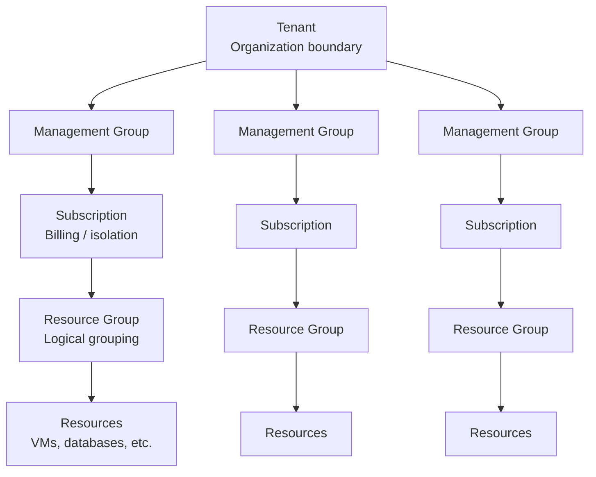

<div style="width: 100%; height: 200px; overflow: hidden; border-radius: 8px; margin-bottom: 1rem;">
  
</div>
*ITL Control Plane Dashboard showing 374 resources, 6 tenants, all managed through a unified abstraction layer*

This is **alpha**. A baby wolf. A first breath of something that might grow into a full-fledged platform, or crash spectacularly trying. Either way, we're building it in public.

The ITL Control Plane is my attempt at solving a problem I've encountered in every enterprise I've worked with: **how do you manage diverse infrastructure without drowning in bespoke scripts and tribal knowledge?**

## The Problem: Building Your Cloud Wrong

Most people think "building your own cloud" means spinning up servers, configuring hypervisors, and wrestling with networking. That's the *data plane*. And jumping straight there is a recipe for an unmaintainable mess.

Before you deploy your first VM, you need answers to:

- **Who can create resources?** (Identity, roles, permissions)
- **How do you organize them?** (Tenants, subscriptions, resource groups)
- **How do you track what exists?** (Metadata, relationships, lineage)
- **How do you audit changes?** (Activity logs, compliance trails)
- **How do you scale governance?** (Policies, management groups, hierarchies)

Azure, AWS, and GCP all solved these problems first. Their control planes (the abstraction layer) came *before* the servers. We're following the same path.

## The Abstraction Layer: ARM-Style Resource Hierarchy

ITL Control Plane implements a hierarchical resource model inspired by Azure Resource Manager (ARM):



Every resource has a **hierarchical ID** that tells you exactly where it lives:

```
/tenants/kadaster/managementgroups/kadaster-platform/subscriptions/sub-prod/resourcegroups/rg-app/providers/ITL.Compute/virtualmachines/vm-web-01
```

This isn't just organization — it's **queryable, auditable, and policy-attachable**. Want to block certain resource types in production subscriptions? Attach a policy at the management group level. Need to audit who created what in the last 30 days? Query the activity log with the tenant scope.

## What's Working (The Dashboard Tour)

Let me show you what's actually functional in this alpha.

### Resource Discovery & Management

The dashboard provides a unified view across all tenants and resource types. Filtering, sorting, export to CSV — the basics that make resource management bearable.


*354 resources across 6 tenants, filterable by tenant, location, and type*

Current counts:
- **374** total resources
- **6** tenants (ITL, Contoso, Fabrikam, Kadaster, etc.)
- **36** management groups
- **50** subscriptions
- **235** resource groups
- **27** locations

### Resource Graph Visualization

Every resource relationship is stored in Neo4j as a graph. The dashboard includes a D3.js force-directed visualization showing how tenants, management groups, subscriptions, and resource groups connect.


*368 nodes, 481 relationships — visualized as an interactive graph*

This isn't just pretty — it's **operational reality**. When you need to understand blast radius ("if I delete this subscription, what resource groups go with it?"), the graph tells you immediately.

### Activity Logs & KQL Query Editor

Every resource operation (CREATE, UPDATE, DELETE) gets logged with full context: who did it, when, what changed, correlation IDs, and response times.


*Audit trail showing resource creation events, compliance-ready*

The query editor supports KQL-style queries for filtering logs:


*Filter logs with KQL: `operation == "CREATE" and tenant == "kadaster"`*

Saved queries and a sample library make common operations repeatable:


*Built-in sample queries organized by category*

### Resource Details

Click any resource to see its full properties, relationships, and actions:


*Kadaster tenant detail view with properties and metadata*

### Infrastructure Monitoring

The platform itself runs as a Docker Compose stack (for local development) or Kubernetes (production). The infra view shows container health and service dependencies:


*7 containers: API Gateway, Core Provider, Dashboard, Neo4j, PostgreSQL, RabbitMQ, CloudBeaver*

## The Architecture: Separation of Concerns

```
┌─────────────────────────────────────────────────────────────┐
│                    API Gateway (FastAPI)                    │
│  Routes requests to resource providers, enforces auth       │
└────────────────────┬────────────────────────────────────────┘
                     │
         ┌───────────┼───────────┐
         ▼           ▼           ▼
    ┌─────────┐ ┌─────────┐ ┌─────────┐
    │   SDK   │ │ Neo4j   │ │Keycloak │
    │(Contracts│ │(Graph   │ │(IAM)    │
    └────┬────┘ │ Metadata│ └────┬────┘
         │      └────┬────┘      │
         └───────────┼───────────┘
                     │
    ┌────────────────┼────────────────┐
    ▼                ▼                ▼
┌──────────┐   ┌──────────┐   ┌──────────┐
│  Core    │   │ Compute  │   │   IAM    │
│ Provider │   │ Provider │   │ Provider │
└──────────┘   └──────────┘   └──────────┘
```

**Key design decisions:**

1. **SDK as Contract Layer** — The Python SDK (`itl-controlplane-sdk`) defines all resource models, request/response structures, and provider interfaces. It's the single source of truth.

2. **Provider Pattern** — Each resource type (compute, IAM, storage) has its own provider service implementing a standardized interface. This allows independent scaling, deployment, and team ownership.

3. **Graph-Based Metadata** — Neo4j stores all resource relationships, enabling queries like "find all resource groups under this management group" or "show the lineage of this resource."

4. **PostgreSQL for State** — The relational database stores resource properties and operational state. The graph stores relationships.

5. **Message Queue for Async** — RabbitMQ handles long-running operations and provider-to-provider communication.

### The Technology Stack (And Why)

| Component | Technology | Why This Choice |
|-----------|------------|----------------|
| **API Gateway** | FastAPI (Python) | Async, type-safe, auto-generated OpenAPI docs, easy to extend |
| **SDK** | Python + Pydantic | Type validation, serialization, IDE support, shared across all services |
| **Graph DB** | Neo4j | Native graph queries for relationships, Cypher is readable, scales well |
| **Relational DB** | PostgreSQL | Battle-tested, JSON support, strong consistency for resource state |
| **Message Queue** | RabbitMQ | Reliable delivery, dead-letter queues, widely understood |
| **IAM** | Keycloak | Full OIDC/OAuth2, realms = tenants, groups/roles, admin API |
| **Containers** | Docker Compose / Kubernetes | Local dev with Compose, production with K8s Helm charts |
| **DB Admin** | CloudBeaver | Web-based SQL client, useful for debugging and demos |

**Why Python everywhere?** Consistency. The SDK, API, providers, and CLI all share the same models. No translation layers, no serialization bugs, no "works in the SDK but breaks in the API" surprises. Plus, Python's async/await with FastAPI handles concurrent requests efficiently.

**Why Neo4j + PostgreSQL (two databases)?** Different data, different access patterns. Resource *properties* (name, location, tags, state) are relational — you query by ID, filter by type, paginate results. Resource *relationships* (this subscription belongs to that management group, which belongs to that tenant) are graph queries. Forcing relationships into SQL joins gets ugly fast when hierarchies are 5+ levels deep.

### Current Providers

| Provider | Status | What It Does |
|----------|--------|-------------|
| **Core Provider** | Working | Tenants, management groups, subscriptions, resource groups, locations |
| **IAM Provider** | In Progress | Keycloak integration — realms, users, groups, roles, service accounts |
| **Compute Provider** | Planned | VM lifecycle via Proxmox/libvirt, container orchestration |
| **Network Provider** | Planned | VNets, subnets, tunnels (WireGuard), DNS zones |
| **Storage Provider** | Planned | Block storage, object storage (MinIO), file shares |

## The CLI: `itlcp`

Following the same pattern as Azure CLI (`az`), we're building `itlcp`, a command-line interface for managing resources:

```bash
# Authenticate (uses ITLAuth/Keycloak tokens)
itlc login

# Create a subscription
itlcp subscription create --name "prod-workloads" --owner "platform-team"

# List resources in a subscription  
itlcp resource list --subscription sub-prod --resource-group rg-app

# Create a VM
itlcp vm create \
  --subscription sub-prod \
  --resource-group rg-app \
  --name vm-web-01 \
  --size Standard_D2s_v3 \
  --location westeurope
```

The CLI uses the same SDK models as the API, ensuring consistency between programmatic and interactive access.

## What's Next (The Roadmap)

This is alpha. **Baby wolf**. Here's what's coming:

### Phase 1: Core Platform

**Identity & Access:**
- IAM Provider with full Keycloak integration
- Service accounts with managed credentials (like Azure Managed Identities)
- PIM-style privileged access with time-bound role elevations and approval workflows
- RBAC at every scope level (tenant, management group, subscription, resource group)

**Governance:**
- Policy engine to deny certain resource types, enforce naming conventions, require tags
- Cost tracking with resource metering, subscription budgets, alerts
- Compliance reports showing who did what, when, with exportable audit trails

### Phase 2: Infrastructure Providers

**Compute:**
- VM Provider via Proxmox VE (KVM-based, REST API)
- Container workloads via Kubernetes (vCluster for tenant isolation)
- Serverless functions (OpenFaaS or Knative)

**Networking:**
- VNet provider for virtual networks with subnet CIDR management
- Cilium, an eBPF-based CNI for high-performance networking and native network policies
- Multus for multi-network attachment, connecting pods to tenant VNets
- Hubble for network observability and flow visibility built on Cilium
- Tunnel provider using WireGuard mesh for secure site-to-site connections
- ZTNA tunnels for Zero Trust Network Access with SPIRE/SPIFFE workload identity
- DNS provider using CoreDNS or PowerDNS with zone delegation per tenant
- Load balancers using HAProxy or Envoy with config-as-resource

> **Why Cilium + Multus + Hubble?** Traditional Kubernetes networking gives you one flat network. For a multi-tenant cloud, you need proper VNet isolation. **Cilium** uses eBPF for kernel-level packet processing, faster than iptables, with L7-aware policies (filter by HTTP path, gRPC method). **Multus** lets pods attach to multiple networks. A pod can have its management interface on the cluster network and a data interface on a tenant-specific VNet. **Hubble** gives you real-time visibility into all network flows without sampling, showing exactly which services are talking to each other, with latency metrics and HTTP status codes. Together, they form the foundation for Azure-style VNet isolation on Kubernetes.

> **Why SPIRE/SPIFFE?** Traditional VPNs trust the network perimeter. Zero Trust says "never trust, always verify": every workload gets a cryptographic identity (SPIFFE ID), and connections are authenticated at the workload level, not the network level. SPIRE issues and rotates these identities automatically. Combined with mTLS, you get encrypted, identity-verified communication between services without managing certificates manually.

**Storage:**
- Block storage via Ceph or local LVM
- Object storage via MinIO (S3-compatible)
- File shares via NFS or SMB with access policies

### Phase 3: Enterprise Features

**Multi-Cloud Bridge:**
- Azure Resource Provider to manage Azure resources through ITL Control Plane
- AWS Resource Provider with the same abstraction, different cloud
- Hybrid policies like "this workload runs on-prem, that one in Azure"

**Developer Experience:**
- Terraform provider for `terraform apply` against ITL Control Plane
- Pulumi provider, same but TypeScript/Python/Go native
- GitOps with resource definitions in Git, auto-reconciled
- Self-service portal where tenant admins manage their own subscriptions

### Infrastructure as Code Vision

The goal is to manage ITL resources the same way you manage Azure or AWS: declaratively.

**Terraform** (HCL):

```hcl
resource "itl_tenant" "acme" {
  name         = "acme"
  display_name = "Acme Corp"
}

resource "itl_subscription" "prod" {
  name   = "prod"
  tenant = itl_tenant.acme.name
  owner  = "platform-team"
}

resource "itl_virtual_machine" "web" {
  name           = "web-01"
  subscription   = itl_subscription.prod.name
  resource_group = "app-rg"
  location       = "westeurope"
  size           = "Standard_D2s"
}
```

**Pulumi** (Python), real code instead of config:

```python
import itl_pulumi as itl

tenant = itl.Tenant("acme", display_name="Acme Corp")
sub = itl.Subscription("prod", tenant=tenant, owner="platform-team")
rg = itl.ResourceGroup("app-rg", subscription=sub, location="westeurope")
vm = itl.VirtualMachine("web-01", resource_group=rg, size="Standard_D2s")
```

Both approaches work. Terraform is widely adopted and declarative. Pulumi gives you loops, conditionals, type safety, and IDE autocomplete. Real programming instead of a DSL. Pick your poison.

**Operations:**
- Helm charts for production Kubernetes deployment
- Prometheus/Grafana integration for platform observability
- Disaster recovery including backup/restore of control plane state

## Why Build This?

The idea started a few months ago, sparked by **geopolitical tensions** and the growing conversation around **data sovereignty**. When your data lives in someone else's cloud, you're subject to their jurisdiction, their policies, their geopolitical reality. CLOUD Act and the list goes on.

What if you need to run infrastructure that stays within your borders? What if "the cloud" needs to be *your* cloud, on premises you control, in datacenters you choose, under laws you understand?

But there's another reason: **demystification**.

Commercial clouds are built on the same technologies available to everyone. Take Entra ID with its Privileged Identity Management (PIM) feature. Sounds enterprise-grade and complex, right? It's role assignments with time-based expiration and approval workflows. Keycloak can do that. Service accounts? Managed identities? Those are just identity tokens with specific scopes and rotation policies. VNets and tunnels? That's VLANs, WireGuard, and routing tables with a nice API in front.

The magic isn't the technology. It's the **abstraction layer** that makes it manageable. Azure doesn't have secret sauce for virtual networks; they have excellent APIs, consistent resource models, and governance tooling that ties it all together.

If you can build the control plane, you can build the cloud. The individual services (compute, storage, networking, identity) are well-understood problems with mature open-source solutions. The hard part is making them work *together* in a governable, multi-tenant, enterprise-ready way.

That's what this project is: proving that the patterns behind commercial clouds are **reproducible** with commodity software and good architecture.

You can't just spin up some VMs and call it a day. You need the same governance, the same abstractions, the same operational patterns that make Azure, AWS, and GCP manageable. **The patterns should feel familiar** — tenants, subscriptions, resource groups, hierarchical IDs, activity logs, RBAC — because these patterns *work*. They've been battle-tested at planetary scale.

But I also saw enterprise after enterprise struggle with common problems:

1. **Shadow IT** — Teams spinning up resources with no governance
2. **Audit nightmares** — "Who created this? When? Why is it still here?"
3. **Cost explosions** — Resources that outlive their purpose
4. **Multi-cloud chaos** — Different tooling for every provider
5. **Tribal knowledge** — The one person who knows where things are leaves

A proper control plane solves these problems **before** you have them. The abstraction layer isn't overhead. It's the foundation everything else builds on.

## Try It Yourself

The codebase is spread across several repositories (it's a microservices architecture, after all):

- `ITL.ControlPanel.SDK` — Python SDK with resource models
- `ITL.ControlPlane.Api` — FastAPI gateway
- `ITL.ControlPlane.Dashboard` — This UI
- `ITL.ControlPlane.ResourceProvider.Core` — Base provider + Docker Compose
- `ITL.ControlPlane.GraphDB` — Neo4j integration

> **Note:** Not every repository is public yet. This is early alpha — I'm cleaning up code, writing documentation, and making sure the repos are ready for external eyes. If you're interested in early access or want to follow along, reach out.

For local development (once repos are available):

```bash
cd ITL.ControlPlane.ResourceProvider.Core
docker-compose up -d
```

That spins up the full stack: API gateway, core provider, dashboard, Neo4j, PostgreSQL, RabbitMQ, and CloudBeaver for database management.

---

**Status:** Alpha (baby wolf)  
**Stack:** Python, FastAPI, Neo4j, PostgreSQL, RabbitMQ, Docker  
**Inspiration:** Azure Resource Manager, Kubernetes Control Plane  
**Goal:** Proper abstraction before infrastructure chaos

It's a small wolf now. Let's see how big it grows.
